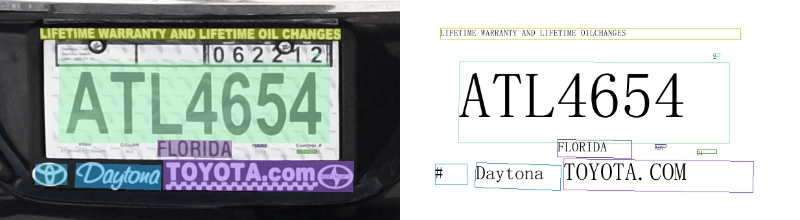
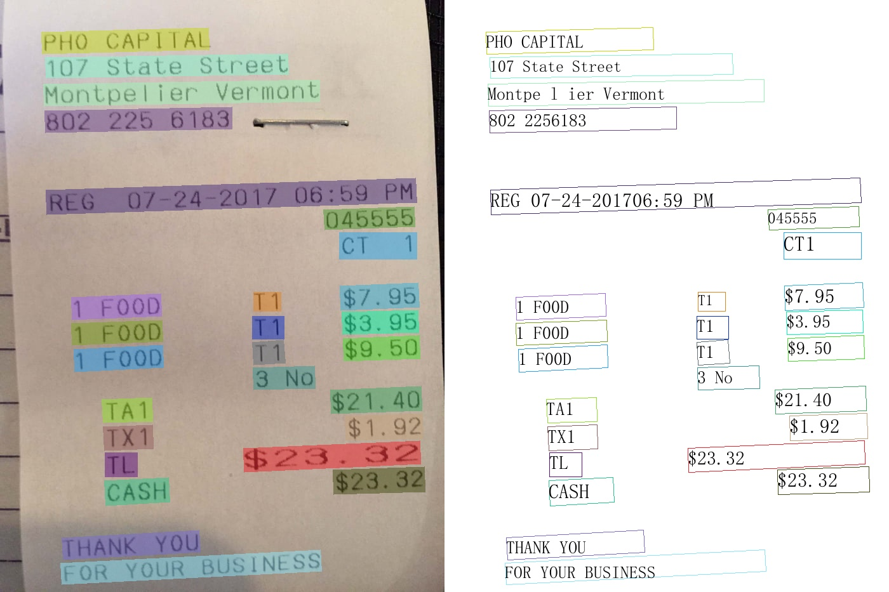
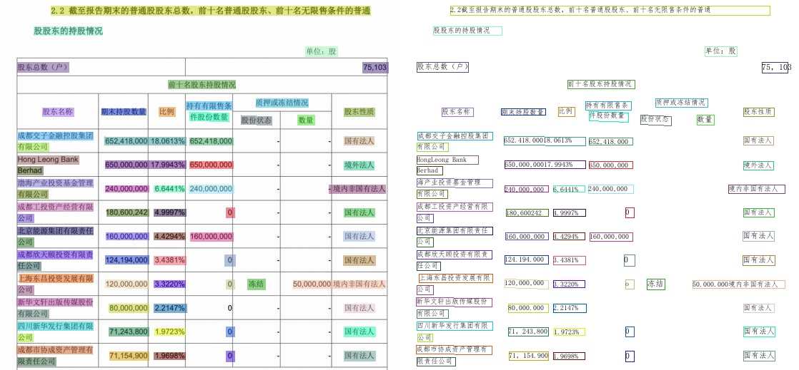
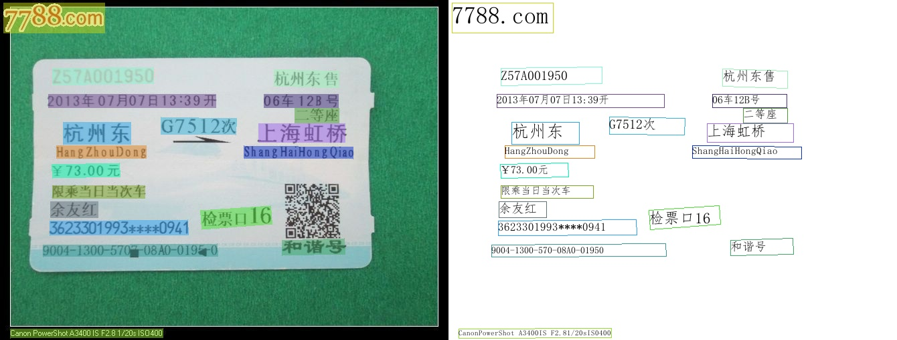
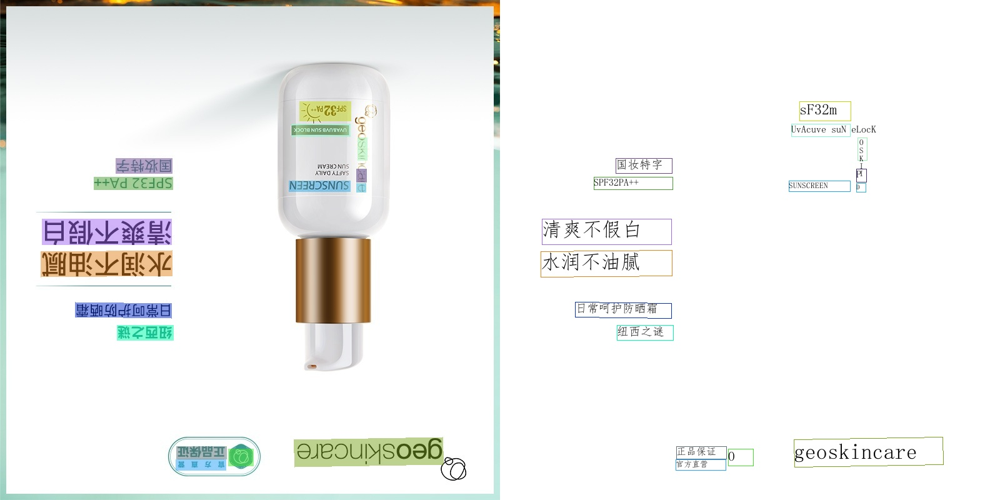
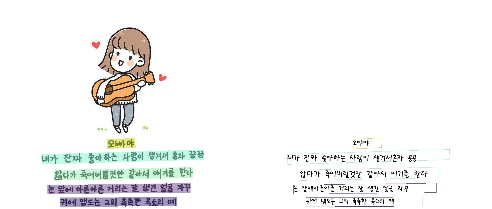

## Introduction
PaddleOCR aims to create multilingual, awesome, leading, and practical OCR tools that help users train better models and apply them into practice.

## Features
- PPOCR series of high-quality pre-trained models, comparable to commercial effects
    - Ultra lightweight ppocr_mobile series models: detection (3.0M) + direction classifier (1.4M) + recognition (5.0M) = 9.4M
    - General ppocr_server series models: detection (47.1M) + direction classifier (1.4M) + recognition (94.9M) = 143.4M
    - Support Chinese, English, and digit recognition, vertical text recognition, and long text recognition
    - Support multi-language recognition: Korean, Japanese, German, French
- Rich toolkits related to the OCR areas
    - Semi-automatic data annotation tool, i.e., PPOCRLabel: support fast and efficient data annotation
    - Data synthesis tool, i.e., Style-Text: easy to synthesize a large number of images which are similar to the target scene image
- Support user-defined training, provides rich predictive inference deployment solutions
- Support PIP installation, easy to use
- Support Linux, Windows, MacOS and other systems

## Visualization

<div align="center">
    
    
    
</div>

The above pictures are the visualizations of the general ppocr_server model. For more effect pictures,

## PP-OCR Pipeline

<div align="center">
    
</div>

PP-OCR is a practical ultra-lightweight OCR system. It is mainly composed of three parts: DB text detection[2], detection frame correction and CRNN text recognition[7]. The system adopts 19 effective strategies from 8 aspects including backbone network selection and adjustment, prediction head design, data augmentation, learning rate transformation strategy, regularization parameter selection, pre-training model use, and automatic model tailoring and quantization to optimize and slim down the models of each module. The final results are an ultra-lightweight Chinese and English OCR model with an overall size of 3.5M and a 2.8M English digital OCR model. For more details, please refer to the PP-OCR technical article (https://arxiv.org/abs/2009.09941). Besides, The implementation of the FPGM Pruner [8] and PACT quantization [9] is based on [PaddleSlim](https://github.com/PaddlePaddle/PaddleSlim).


## Visualization 
- Chinese OCR model
<div align="center">
    
    
    
    
</div>

- English OCR model
<div align="center">
    
</div>

- Multilingual OCR model
<div align="center">
    
    
</div>
<a name="language_requests"></a>

### 1. Clone the Repository
```bash
 git clone https://github.com/youssefellouh/PaddleOCR_Project_An_Integrated_OCR_Approach_Based_on_DBNet_and_CRNN.git
 cd PaddleOCR_Project_An_Integrated_OCR_Approach_Based_on_DBNet_and_CRNN

```
### 2. Set Up a Virtual Environment
```bash
   python3 -m venv .venv
source .venv/bin/activate 
```
### 3. Install Dependencies
``` bash
  pip install -r requirements.txt
```
